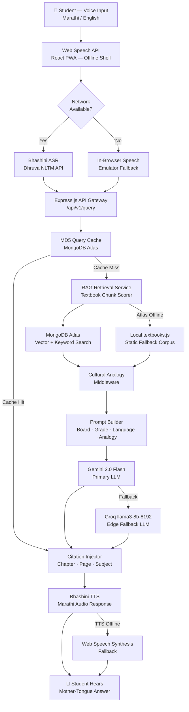

# Grama-Gyan AI (ग्राम-ज्ञान): Offline-First Vernacular Science Tutor for Rural India

<div align="center">

**India's First Offline-Resilient, Voice-First AI Tutor Built for Bharat**

*Bridging the rural education gap — one voice at a time.*

[](https://opensource.org/licenses/MIT)
[](https://nodejs.org/)
[](https://reactjs.org/)
[](https://www.mongodb.com/atlas)
[](https://ai.google.dev/)
[](https://bhashini.gov.in/)
[](http://makeapullrequest.com)

</div>

Grama-Gyan is a responsive Web Application and Microservice layer engineered to deliver high-quality, curricularly aligned, and culturally contextualized Science and Technology guidance to secondary students (Class 9 & 10) in remote division classrooms across Maharashtra and other rural Indian states.

Designed specifically for intermittent off-grid connectivity and powered by Gemini models, Grama-Gyan bridges abstract scientific principles (gravity, force, magnetism) with familiar agrarian and rural household analogies.

---
## Mockups


---

## Key Features

1. **Bilingual Conversational Interface**: Fluid translation and vocal assistance between Marathi and English (Marathi standard pronunciation assists).
2. **Textbook Grounding (RAG)**: Search queries undergo dynamic vector keyword matching against Maharashtra SSC and CBSE standard textbooks. 
3. **Indigenous Village Analogies**: Concepts like *buoyancy* and *pressure* are mapped onto indigenous, authentic rural tools (e.g. *gophan*, clay stoves, water well pulleys, bullock carts).
4. **Offline Resilience Architecture**: Standard local conversation databases saved natively on device caches (indexedDB/localStorage wrapper) to guarantee offline retrieval during cellular signal dropouts.
5. **Teacher & Community Crowdsourcing Portal**: Empower educators to submit local cultural analogies to the active tutor database.

---
## Architecture



---

## How It Works
 
A student named Priya in Nashik asks: *"बल म्हणजे काय?"* ("What is force?")
 
```
Step 1  VOICE CAPTURE
        VoiceMicButton.jsx captures audio via Web Speech API
        → Sent as base64 to POST /api/v1/asr
 
Step 2  SPEECH-TO-TEXT
        Bhashini Dhruva ASR transcribes Marathi audio → structured text
        Fallback: In-browser Web Speech Emulator if Bhashini key absent
 
Step 3  CACHE LOOKUP
        MD5 hash of (query + board + class + language) checked in QueryCache
        → Cache hit: return stored response instantly (offline resilient)
        → Cache miss: proceed to retrieval
 
Step 4  RAG RETRIEVAL
        retrieveRelevantChunks() scores Maharashtra SSC textbook chunks
        by keyword match: title (+10pts), chapter (+5pts), content (+2pts)
        → Primary: MongoDB Atlas live collection
        → Fallback: static textbooks.js corpus (zero network required)
 
Step 5  CULTURAL ANALOGY MATCHING
        findAnalogyForQuery() scans AnalogyLibrary by keyword
        "Force" → "Like a bullock pulling a plough — the harder it pulls,
        the more force it applies. That is Newton's Second Law."
        → Primary: MongoDB AnalogyLibrary collection
        → Fallback: pre-seeded CULTURAL_ANALOGIES in memory
 
Step 6  PROMPT ASSEMBLY
        assemblePromptContext() builds a bilingual system instruction:
        · Student name, village, board, class, language
        · Serialised textbook chunks with source metadata
        · Cultural analogy directive (weave in naturally)
        · Warm greeting and closing learning tip instruction
 
Step 7  LLM GENERATION
        generateTutorResponse():
        → Primary: Gemini 2.0 Flash (gemini-2.0-flash)
        → Fallback: Groq llama3-8b-8192 (temperature 0.2, max 1024 tokens)
 
Step 8  CITATION INJECTION
        Response packaged with citations array:
        { chapter, chapter_number, page, snippet, subject }
        Result stored asynchronously in QueryCache for future offline hits
 
Step 9  TEXT-TO-SPEECH
        POST /api/v1/tts → Bhashini TTS → Marathi female voice audio
        Fallback: Google Translate TTS URL (browser playback)
 
Step 10 STUDENT HEARS THE ANSWER
        AudioPlayer.jsx plays response in Priya's mother tongue
        CitationBadge.jsx displays: "Ch. 9 · Page 42 · Science"
        AnswerCard.jsx shows the bullock plough analogy inline
```
 
---
## Operational File Structure

The project has been architected according to proper modern multi-service repository patterns:

```text
grama-gyan-ai/
│
├── README.md                 ← Main directory guidebook
├── .env.example              ← System variable templates
│
├── backend/                  ← Express.js API services
│   ├── package.json          ← Backend dependencies
│   ├── server.js             ← Express main entry point
│   ├── config/               ← Mongo Connection, Groq API, Bhashini configs
│   ├── routes/               ← Query routing tables (/query, /asr, /tts)
│   ├── services/             ← Orchestrators, Vector matches, voice synth
│   ├── middleware/           ← Security, Rate limiters, validators
│   ├── models/               ← Mongoose database schemas
│   └── utils/                ← Vernacular detection & noun parsers
│
├── frontend/                 ← React.js user dashboard
│   ├── package.json          ← Client-side requirements
│   ├── vite.config.js        ← Vite bundler proxy configuration
│   ├── src/                  ← Components, contexts, and sw workers
│   └── tailwind.config.js    ← Neo-brutalist custom color configurations
│
└── ingestion/                ← Textbook semantic parsing pipeline
    ├── package.json
    └── main.js               ← Automatic textbook parser and generator
```

---

## Installation
 
### Prerequisites
 
- Node.js 20.x
- npm 10.x
- Docker & Docker Compose (optional, for containerised setup)
- MongoDB Atlas cluster (or local MongoDB for development)


## Local Environment Kickoff

To run the unified stack locally on your workstation, configure your secrets block and run:

```bash
# Clone the repository
git clone https://github.com/builds/grama-gyan-ai.git
cd grama-gyan-ai

# Set up variables
cp .env.example .env
```

### Option A: Run Unified Sandbox Developer Server (Default)
This builds and boots both backend and frontfacing channels simultaneously out of the container core:
```bash
npm install
npm run dev
# Server initiates on Port 3000
```

### Option B: Run Service Modules Separately
To configure individual docker nodes or localized process managers:

**Backend Setup:**
```bash
cd backend
npm install
npm run dev # Initiates on Port 3001
```

**Frontend Setup:**
```bash
cd frontend
npm install
npm run dev # Initiates Vite on Port 3000
```

---

## Roadmap
 
```
Phase 1 — Foundation (Current)
 
✓ Voice-first interaction (Bhashini ASR/TTS)
✓ RAG pipeline grounded in SSC Maharashtra + CBSE textbooks
✓ Cultural Analogy Middleware with pre-seeded library
✓ Dual-mode offline architecture (Atlas cache + IndexedDB)
✓ Teacher contribution portal (live analogy ingestion)
✓ LLM fallback chain (Gemini → Groq)
✓ Docker Compose deployment
 
 
Phase 2 — Expansion (Near-Term)
 
- Offline cache hit rate optimization
- Teacher gap-analytics dashboard
- SMS/IVR fallback for zero-internet feature phone access
- Karnataka SSLC textbook ingestion pipeline
- Expanded language support (Kannada, Tamil, Telugu)
 
 
Phase 3 — Intelligence (Mid-Term)
 
- Adaptive personalized learning paths per student
- Peer-to-peer cached Q&A sharing via local mesh networks
- RAGAS-based RAG evaluation pipeline
- BM25 + vector hybrid retrieval
 
 
Phase 4 — Scale (Long-Term)
 
- On-device small language model (full offline inference)
- Complete cloud independence for rural government schools
- Zilla Parishad / SSA deployment partnerships
- CSR and national EdTech challenge funding integration
```


## Telemetry and Core Environment Variables

Copy `.env.example` and supply your variables:

* `GEMINI_API_KEY`: Generative language engine (Gemini 3.5 Flash).
* `MONGODB_URI`: Persistent database cluster storing students and logs.
* `GROQ_API_KEY`: Fallback backup LLM.
* `BHASHINI_API_KEY`: India National Language Translation Mission key.

---

## References
 
- ASER Centre (2025). *Annual Status of Education Report (ASER) 2024*. [asercentre.org](https://asercentre.org/wp-content/uploads/2022/12/ASER-2024-National-findings.pdf)
- UNESCO (2022). *Why Mother Language-Based Education is Essential*. [unesco.org](https://www.unesco.org/en/articles/why-mother-language-based-education-essential)
- UNESCO (2025). *Languages Matter: Global Guidance on Multilingual Education*. [unesco.org](https://www.unesco.org/en/articles/languages-matter-global-guidance-multilingual-education)
- Bhashini — National Language Translation Mission. [bhashini.gov.in](https://bhashini.gov.in/)
- NEP 2020 — Ministry of Education, Government of India.
---

*Crafted with 💛 for Indian rural school students and regional state board science classrooms.*
